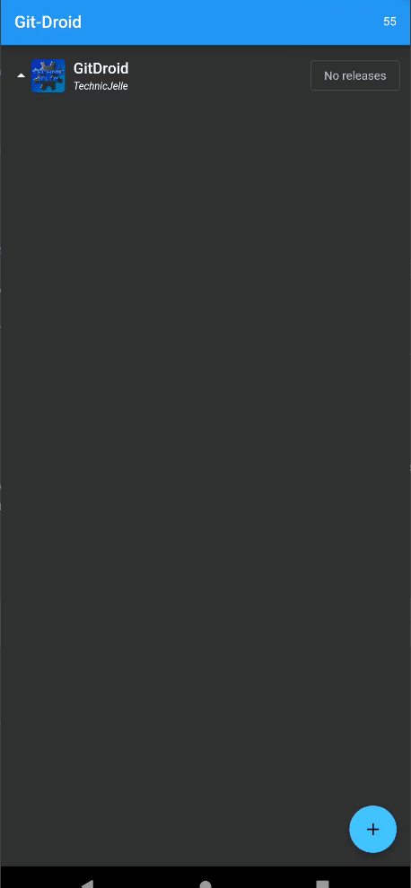

# Git-Droid

An app store for apps uploaded to GitHub releases

> [!WARNING]
> Technically "in development", but currently not actively developed.  
> This was my first ever Flutter app and it shows.  
> Perhaps some day, I'll have the time to continue working on this app again.  
> You should probably use **Obtainium** instead.

